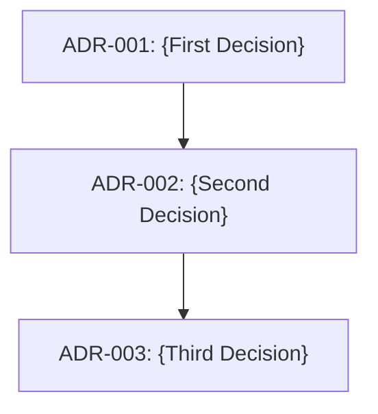

# Architecture Decision Records Index

> Last updated: {YYYY-MM-DD}

## Dependency Order

_Update this diagram as ADRs are added. Show which decisions depend on others._

## ADR Registry

| # | Title | Status | Phase | Current Note |
|---|-------|--------|-------|-------------|
| [001](001-qol-and-polish-features.md) | Quality of Life and Polish Features | **Proposed** | Phase 1 | Initial draft added |

## Phase Mapping

| GDD Phase | ADRs | Current Status |
|-----------|------|----------------|
| **Phase 1** — Stabilize Prototype | ADR-{NNN} | {status} |
| **Phase 2** — Split Core Runtime | ADR-{NNN} | {status} |
| **Phase 3** — Data-Drive Content | ADR-{NNN} | {status} |

## How to Use

1. **Before making an architecture decision** → Check this index for existing decisions
2. **To create a new ADR** → Copy `_TEMPLATE.md` → Name it `{NNN}-{kebab-case-title}.md`
3. **After creating** → Add a row to the registry table above
4. **When superseding** → Update the old ADR's status to `Superseded by ADR-{NNN}`
